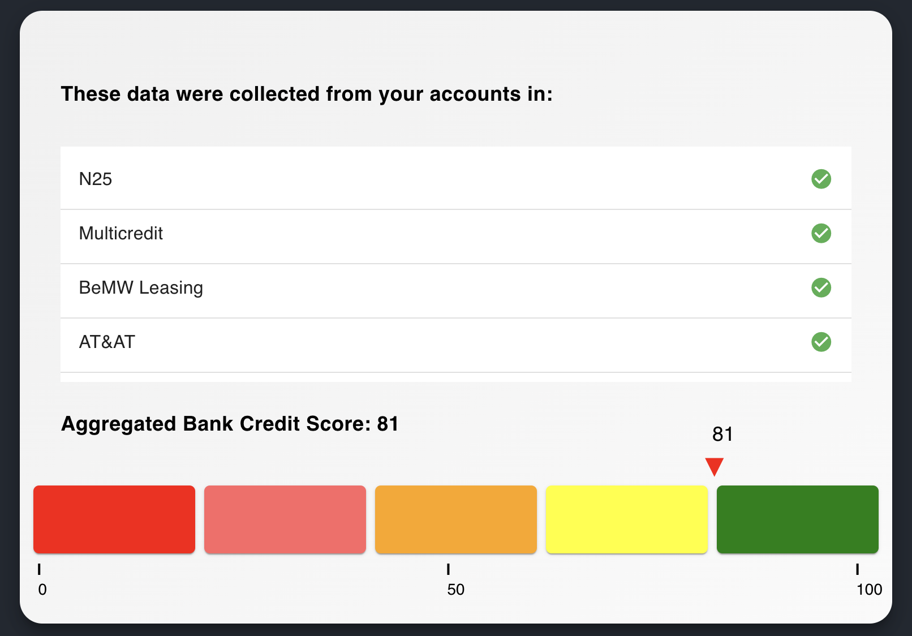

# SCHUFHER

SCHUFA, but keep your data to yourself

## Overview

SchuFHEr aims to compute a Schufa-like credit score without having to rely on an intransparent scoring system that gives a private company access to some of the most sensitive personal data. 

To achieve this, the credit agency now only acts as a possible source for gathering a person's different bank account or credit providers.
The providers and the agency add their relevant data to an encrypted pool of (e.g., transaction) information.
A ML model runs directly on the encrypted data and calculates a credit rating using fully homomorphic encryption (FHE) and returns it in an encrypted fashion.
The participating parties can then decrypt the rating, without being able to decrypt the information provided by other institutions.
During the entire process, the data submitted by any party can not be viewed by any other party, while still being able to compute a rating from the combined data submissions.

## Setup

`docker compose up --build`.

(if poetry complains, run `poetry lock` in the backend folder)

The frontend and bank data API are started this way, the ML model is run in a separate jupyter notebook since it would not run directly on Apple Silicon.
The endpoints in the Vue.js files have to be adjusted accordingly if self-hosted.

The frontent can be accessed at http://localhost:8888.

## Collaborators
https://github.com/Aysenur-TUM

https://github.com/neodyma

https://github.com/ThomasW97

https://github.com/Tsatsch

